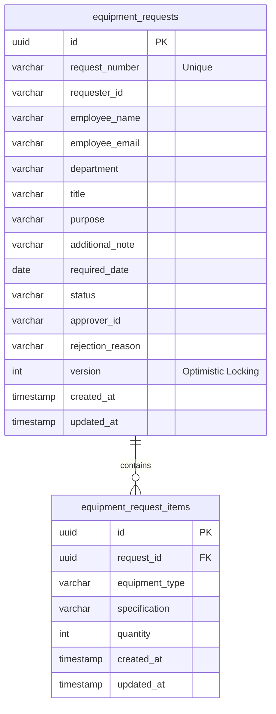
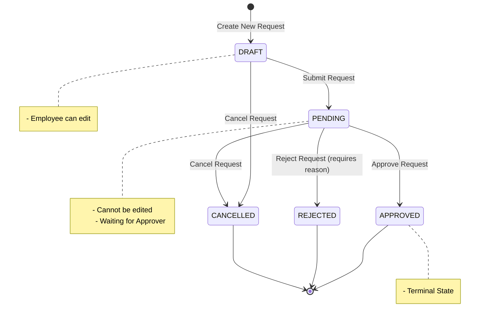
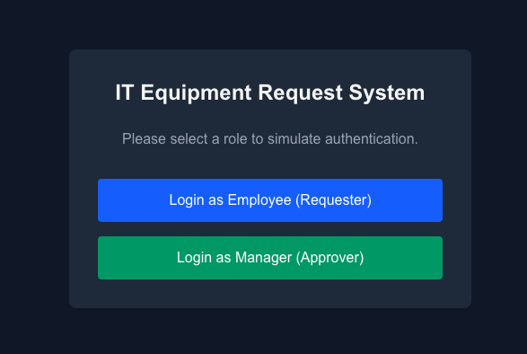
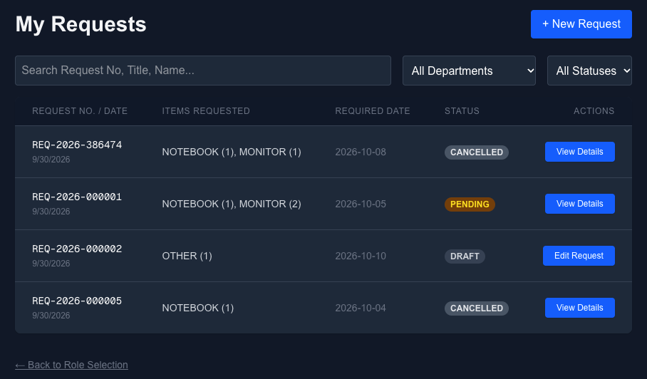
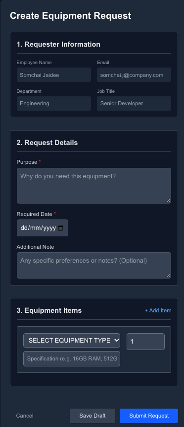
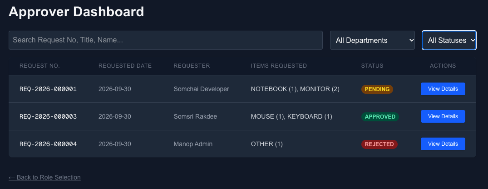
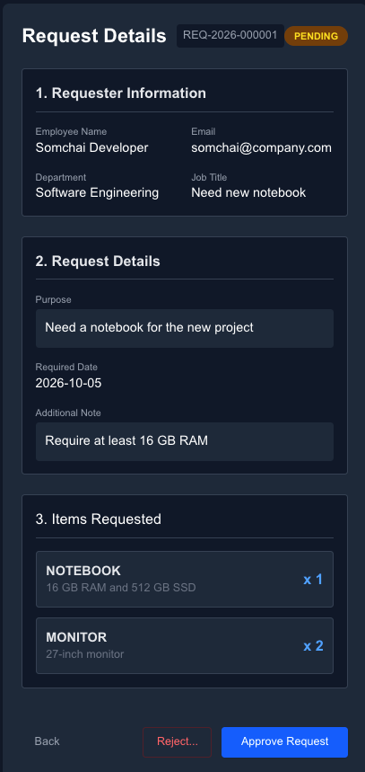
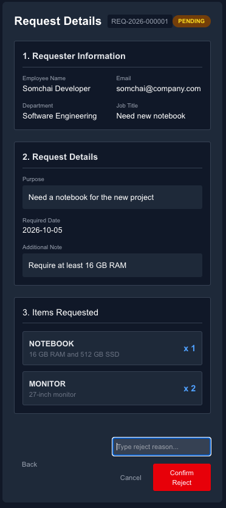

# Equipment Request System

ระบบจัดการเบิกจ่ายอุปกรณ์ไอที (Equipment Request System) สำหรับพนักงานและผู้อนุมัติ พัฒนาขึ้นด้วยสถาปัตยกรรมที่แยกส่วนชัดเจนระหว่าง Frontend (React/Next.js) และ Backend (Spring Boot/Kotlin) โดยให้ความสำคัญกับความถูกต้องของข้อมูล (Data Integrity), การตรวจสอบสิทธิ์ (Validation), และการจัดการการทำงานพร้อมกัน (Concurrency)

## 📌 1. Environment (สภาพแวดล้อมที่ต้องการ)
- **OS**: macOS / Linux / Windows
- **Node.js**: v20.x ขึ้นไป (ใช้สำหรับการรัน Frontend)
- **JDK Version**: Java 21 (ใช้สำหรับการรัน Backend)
- **Database**: PostgreSQL 16
- **Cache**: Redis 7
- **Tools**: Docker & Docker Compose, Maven, npm

---

## 🚀 2. Run (วิธีติดตั้งและใช้งาน)

### 2.1 การเตรียม Database (PostgreSQL & Redis)
ระบบใช้ Docker Compose ในการรันฐานข้อมูลและ Cache หากมี Docker ติดตั้งแล้ว ให้รันคำสั่งที่ Root ของโปรเจค:
```bash
docker-compose up -d
```

### 2.2 การรัน Backend (Spring Boot)
Backend ถูกออกแบบให้จัดการ Schema อัตโนมัติด้วย **Flyway** (ไม่มีการใช้ `ddl-auto=create`) เมื่อรันเซิร์ฟเวอร์ครั้งแรก ตารางทั้งหมดจะถูกสร้างเอง 
```bash
cd backend
mvn clean spring-boot:run -Dmaven.test.skip=true
```
*เซิร์ฟเวอร์จะรันอยู่ที่: `http://localhost:8080`*

### 2.3 การรัน Frontend (Next.js)
```bash
cd frontend
npm install --legacy-peer-deps
npm run dev
```
*เว็บแอปพลิเคชันจะรันอยู่ที่: `http://localhost:3000`*

---

## 🧪 3. Test & API (การทดสอบและเอกสาร)

### การรัน Automated Tests
**Backend (JUnit 5 + Mockito + MockK):** 
```bash
cd backend
mvn test
```

**Frontend (Vitest + React Testing Library):** 
```bash
cd frontend
npx vitest run
```

### API Documentation (Postman)
สามารถนำไฟล์ `API_Collection.json` ที่อยู่ใน Root Directory ไป Import เข้า **Postman** หรือ **Bruno** เพื่อใช้ทดสอบ Endpoint ทั้งหมดได้ทันที (มีการแนบ Header `X-User-Id` และ `X-Role` สำหรับจำลองสิทธิ์ให้แล้ว)

---

## 📐 4. Decisions (สิ่งที่เลือกใช้เพิ่มเติมเหนือจากที่โจทย์กำหนด)

เพื่อให้โปรเจคนี้มีมาตรฐานระดับ **Production-Ready** และสามารถสเกลได้จริง เราได้ตัดสินใจเลือกใช้เครื่องมือและออกแบบสถาปัตยกรรมที่ "เกินกว่า" requirement พื้นฐานของโจทย์ ดังนี้:

### 4.1 เทคโนโลยีฝั่ง Backend
1. **Kotlin (แทน Java):** เลือกใช้ Kotlin เพื่อโค้ดที่กระชับและปลอดภัยจาก `NullPointerException` (Null-safety)
2. **Flyway (แทน Hibernate DDL-Auto):** แทนที่จะให้ ORM สร้างตารางเองแบบออโต้ ซึ่งเสี่ยงต่อข้อมูลพังใน Production เราใช้ Flyway Migration Script ควบคุม Version ของ Database Schema (V1, V2)
3. **Optimistic Locking (`@Version`):** โจทย์ไม่ได้บังคับเรื่อง Concurrency แต่เราจัดการปัญหานี้ไว้ล่วงหน้า หากผู้ใช้งาน 2 คนเปิดหน้าแก้ไขคำขอเดียวกันพร้อมกัน คนที่กดเซฟทีหลังจะโดนตีกลับด้วย HTTP 409 Conflict (ไม่เซฟทับมั่วซั่ว)
4. **Action-based API:** แทนที่จะสร้าง API แบบ CRUD ทั่วไป (ที่ยอมให้ Client ส่งค่า Status = APPROVED มาตรงๆ) เราบังคับใช้ Endpoint เชิงพฤติกรรม เช่น `POST /{id}/submit` หรือ `POST /{id}/decision` เพื่อป้องกันช่องโหว่ด้านความปลอดภัย

### 4.2 เทคโนโลยีฝั่ง Frontend
1. **Next.js (App Router):** เลือกใช้ Framework สมัยใหม่แทน React (Vite/CRA) ธรรมดา เพื่อให้พร้อมต่อยอดระบบ Routing แบบ Server Components ในอนาคต
2. **Zod + React Hook Form:** โจทย์ต้องการแค่ Validation แต่เราเลือกใช้คู่มือนี้เพื่อให้การ Validate ฝั่ง Client ลื่นไหลที่สุด ลดการ Re-render ของ React ทุกครั้งที่พิมพ์ (Performance ดีขึ้น) และแมป Error กลับมาจาก Backend ได้แม่นยำ
3. **Vitest (แทน Jest):** เลือกใช้ Test Runner ยุคใหม่ที่เร็วกว่าและรองรับ TypeScript/ESM แบบ Native ทันที โดยไม่ต้องคอนฟิก Babel ให้วุ่นวาย
4. **URL Search Params สำหรับ Filter:** ข้อมูลการค้นหาทั้งหมด (Keyword, Status) ถูกเก็บลง URL Parameter (แทนการเก็บลง `useState` ปกติ) เพื่อให้ผู้ใช้สามารถกด Refresh หน้าเว็บ หรือแชร์ลิงก์ให้คนอื่นได้โดยที่ฟิลเตอร์ไม่หาย


---

## 📂 5. Folder Structure (โครงสร้างโปรเจค)

### Frontend (Next.js)
```text
frontend/
├── src/
│   ├── app/            # Next.js App Router (ระบบ Routing และ UI ของแต่ละหน้า)
│   ├── hooks/          # Custom React Hooks (เช่น useEquipmentRequests, useUnsavedChanges)
│   ├── lib/            # ไฟล์ Utilities (ตัวจัดการ API และ Zod Schema สำหรับ Validate)
│   ├── types/          # ประกาศ TypeScript Interfaces
│   └── __tests__/      # ไฟล์สำหรับทำ Automated Test (Vitest)
├── public/             # เก็บไฟล์ Static Assets (รูปภาพต่างๆ)
└── package.json        # ไฟล์จัดการ Dependencies
```

### Backend (Spring Boot + Kotlin)
```text
backend/
├── src/
│   ├── main/
│   │   ├── kotlin/com/ttb/equipment/
│   │   │   ├── application/    # Business Logic (Services สำหรับจัดการ Use cases)
│   │   │   ├── configuration/  # ไฟล์ Config (CORS, Global Exception Handler)
│   │   │   ├── controller/     # REST API Endpoints แยกระหว่าง Query กับ Command
│   │   │   ├── domain/         # JPA Entities และ Enums
│   │   │   ├── dto/            # Data Transfer Objects (คัดกรองข้อมูลก่อนรับ/ส่ง)
│   │   │   ├── exception/      # Custom Exceptions ที่สร้างขึ้นมาใช้เฉพาะในโปรเจค
│   │   │   └── repository/     # Data Access Layer (Spring Data JPA)
│   │   └── resources/
│   │       ├── db/migration/   # ไฟล์ Flyway Migration (V1 Schema, V2 Seed Data)
│   │       └── application.yml # ตั้งค่าเชื่อมต่อ Database และ Server
│   └── test/                   # ไฟล์สำหรับรัน Unit & Integration Tests (JUnit 5, MockK)
└── pom.xml                     # ไฟล์จัดการ Maven Dependencies
```

## ⚠️ 6. Scope (สมมติฐานและข้อจำกัด)

### Assumptions (สมมติฐาน)
- **Mock Authentication:** ระบบไม่มีหน้า Login จริง ใช้แนวทางจำลอง (Mock) ผ่าน Request Header (`X-User-Id`, `X-Role`) แทน เพื่อเน้นพัฒนา Logic อนุมัติ 
- **Approval Flow:** มีกระบวนการอนุมัติแค่ 1 ขั้นตอน (Single-tier approval) คือ Employee ส่งให้ Approver จบเลย (ไม่มี Manager -> Director)
- **Role Assignment:** ในระบบนี้ สมมติให้ใครก็ตามที่เข้าหน้า `/approver/dashboard` มีสิทธิ์อนุมัติทุกคน (ใช้สำหรับการ Demo)

### Known Limitations (ข้อจำกัดที่ทราบ)
- **File Upload:** ยังไม่รองรับการแนบไฟล์รูปภาพหรือเอกสารอ้างอิงในใบเบิก
- **Notification:** ยังไม่มีระบบส่ง Email หรือ Push Notification แจ้งเตือนเมื่อสถานะคำขอเปลี่ยนแปลง

---

## 📊 7. Database Schema & Architecture Diagrams

### Entity-Relationship (ER) Diagram
โครงสร้างตารางหลักที่ใช้ในระบบประกอบด้วยตาราง `equipment_requests` (คำขอ) และ `equipment_request_items` (รายการอุปกรณ์ในแต่ละคำขอ) ซึ่งมีความสัมพันธ์แบบ One-to-Many



### System Flow & State Machine
การเปลี่ยนสถานะ (Status Transition) ของคำขอเบิกอุปกรณ์ จะถูกควบคุมด้วย State Machine ในฝั่ง Backend ดังนี้:



---

## 🖥️ 8. UI Captures (ภาพหน้าจอระบบ)

### 1. หน้าเข้าสู่ระบบ (Mock Auth Selection)


### 2. หน้า Dashboard สำหรับพนักงาน (Employee Dashboard)


### 3. หน้า Form สร้างคำขอเบิกอุปกรณ์ (Create Request)


### 4. หน้า Dashboard สำหรับผู้อนุมัติ (Approver Dashboard)


### 5. หน้ารายละเอียดคำขอเบิก (Request Details)


### 6. การปฏิเสธคำขอพร้อมระบุเหตุผล (Reject Modal)

