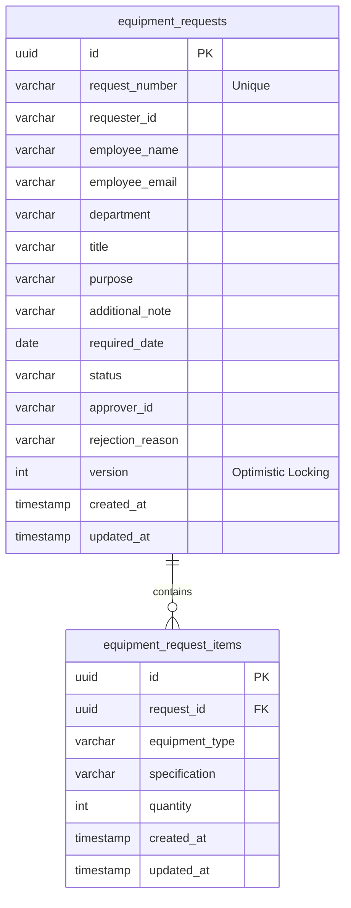
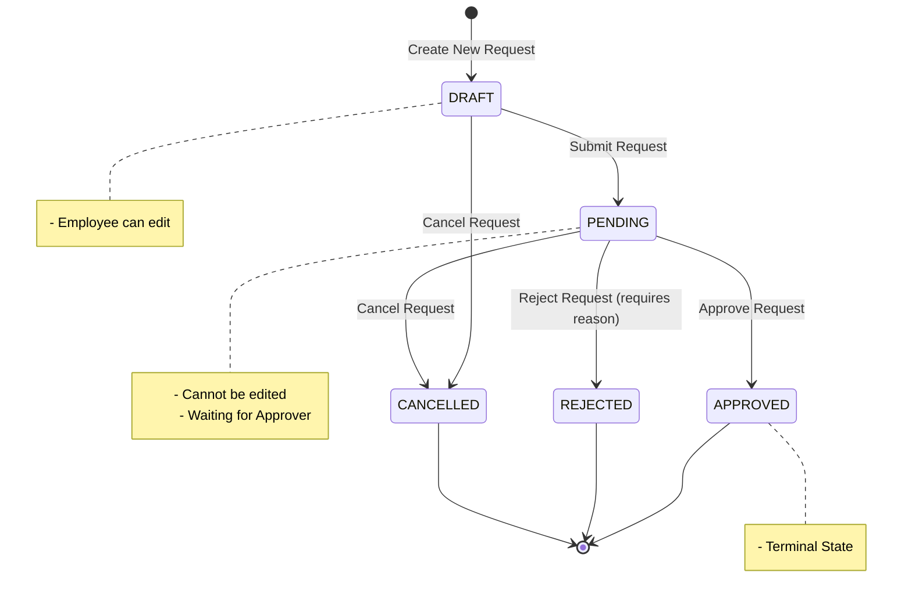

# Equipment Request System

ระบบจัดการเบิกจ่ายอุปกรณ์ไอที (Equipment Request System) สำหรับพนักงานและผู้อนุมัติ พัฒนาขึ้นด้วยสถาปัตยกรรมที่แยกส่วนชัดเจนระหว่าง Frontend (React/Next.js) และ Backend (Spring Boot/Kotlin) โดยให้ความสำคัญกับความถูกต้องของข้อมูล (Data Integrity), การตรวจสอบสิทธิ์ (Validation), และการจัดการการทำงานพร้อมกัน (Concurrency)

## 1. Project Requirements (ขอบเขตและข้อกำหนดของระบบ)

โปรเจคนี้ถูกพัฒนาขึ้นเพื่อตอบสนองต่อโจทย์ความต้องการของระบบจัดการเบิกจ่ายอุปกรณ์ไอที โดยมีข้อกำหนดหลักดังต่อไปนี้:

1. **ระบบจัดการคำขอเบิกอุปกรณ์ (Request Management)**
   - ผู้ใช้งาน (Employee) สามารถสร้าง, บันทึกฉบับร่าง (Draft), แก้ไข, และส่งคำขอเบิกอุปกรณ์ได้
   - ใน 1 คำขอเบิก สามารถเพิ่มรายการอุปกรณ์ (Equipment Items) ได้หลายรายการแบบ Dynamic (รองรับ 1-5 ชิ้นต่อรายการ)
   - มีการตรวจสอบความถูกต้องของข้อมูล (Validation) ทั้งฝั่ง Frontend และ Backend อย่างเคร่งครัด
2. **ระบบการอนุมัติและการจัดการสิทธิ์ (Role & Approval Flow)**
   - แบ่งผู้ใช้งานออกเป็น 2 บทบาทหลัก ได้แก่ **Employee** (ผู้เบิก) และ **Approver** (ผู้อนุมัติ)
   - ผู้อนุมัติสามารถเข้าถึงรายการคำขอทั้งหมด และดำเนินการ **อนุมัติ (Approve)** หรือ **ปฏิเสธ (Reject)** ได้
   - หากดำเนินการปฏิเสธคำขอ (Reject) ระบบบังคับให้ต้องระบุเหตุผลประกอบเสมอ
3. **การแสดงผลและค้นหา (Dashboard & Filtering)**
   - มีหน้ารายการ (Data Table) สำหรับแสดงข้อมูลคำขอเบิกทั้งหมด
   - รองรับการค้นหาผ่าน Keyword และการกรองข้อมูล (Filter) ตามสถานะของคำขอ
4. **การควบคุมสถานะของคำขอ (State Machine)**
   - ระบบต้องควบคุมการเปลี่ยนผ่านสถานะอย่างเข้มงวด ได้แก่ `DRAFT` ➔ `PENDING` ➔ `APPROVED` / `REJECTED` / `CANCELLED`
   - คำขอที่อยู่ในสถานะปลายทาง (Terminal States) จะไม่อนุญาตให้แก้ไขข้อมูลได้อีก


---

## 2. Environment (สภาพแวดล้อมที่ต้องการ)
- **OS**: macOS / Linux / Windows
- **Node.js**: v20.x ขึ้นไป (ใช้สำหรับการรัน Frontend)
- **JDK Version**: Java 21 (ใช้สำหรับการรัน Backend)
- **Database**: PostgreSQL 16
- **Cache**: Redis 7
- **Tools**: Docker & Docker Compose, Maven, npm

---

## 3. Run (วิธีติดตั้งและใช้งาน)

### 3.1 การเตรียม Database (PostgreSQL & Redis)
ระบบใช้ Docker Compose ในการรันฐานข้อมูลและ Cache หากมี Docker ติดตั้งแล้ว ให้รันคำสั่งที่ Root ของโปรเจค:
```bash
docker-compose up -d
```

### 3.2 การรัน Backend (Spring Boot)
Backend ถูกออกแบบให้จัดการ Schema อัตโนมัติด้วย **Flyway** (ไม่มีการใช้ `ddl-auto=create`) เมื่อรันเซิร์ฟเวอร์ครั้งแรก ตารางทั้งหมดจะถูกสร้างเอง 
```bash
cd backend
mvn clean spring-boot:run -Dmaven.test.skip=true
```
*เซิร์ฟเวอร์จะรันอยู่ที่: `http://localhost:8080`*

### 3.3 การรัน Frontend (Next.js)
```bash
cd frontend
npm install --legacy-peer-deps
npm run dev
```
*เว็บแอปพลิเคชันจะรันอยู่ที่: `http://localhost:3000`*

---

## 4. Test & API (การทดสอบและเอกสาร)

### การรัน Automated Tests
**Backend (JUnit 5 + Mockito + MockK):** 
```bash
cd backend
mvn test
```

**Frontend (Vitest + React Testing Library):** 
```bash
cd frontend
npx vitest run
```

### API Documentation (Postman)
สามารถนำไฟล์ `API_Collection.json` ที่อยู่ใน Root Directory ไป Import เข้า **Postman** หรือ **Bruno** เพื่อใช้ทดสอบ Endpoint ทั้งหมดได้ทันที (มีการแนบ Header `X-User-Id` และ `X-Role` สำหรับจำลองสิทธิ์ให้แล้ว)

---

## 5. Architecture & Technical Decisions (การตัดสินใจทางสถาปัตยกรรมและเทคโนโลยีเพิ่มเติม)

ในการพัฒนาระบบนี้ นอกเหนือจากการบรรลุข้อกำหนดเบื้องต้นของโจทย์ (Requirements) แล้ว ทางผู้พัฒนาได้เลือกใช้เทคโนโลยีและแนวทางการออกแบบระบบเพิ่มเติม เพื่อยกระดับสถาปัตยกรรมให้สอดคล้องกับมาตรฐานทางอุตสาหกรรม (Industry Standards) สำหรับซอฟต์แวร์ระดับ Production ดังต่อไปนี้:

### 4.1 สถาปัตยกรรมและเทคโนโลยีฝั่ง Backend
1. **การใช้ภาษา Kotlin:** เลือกใช้แทน Java เพื่อลดความซับซ้อนของโค้ด (Conciseness) และใช้ประโยชน์จากระบบ Null-Safety ในการป้องกันข้อผิดพลาดประเภท `NullPointerException` ในขณะรันไทม์
2. **การจัดการ Database Migration ด้วย Flyway:** ยกเลิกการใช้ `hibernate.ddl-auto` ในการสร้างตารางอัตโนมัติ และเปลี่ยนมาใช้ Flyway ในการควบคุมเวอร์ชันของ Database Schema อย่างเป็นระบบ เพื่อป้องกันการสูญหายของข้อมูลในสภาพแวดล้อม Production
3. **การจัดการสภาวะการทำงานพร้อมกัน (Concurrency Control):** ประยุกต์ใช้ **Optimistic Locking** ผ่านคำสั่ง `@Version` ในระดับ Entity แม้โจทย์จะไม่ได้ระบุไว้ เพื่อป้องกันปัญหา Data Overwrite ในกรณีที่ผู้ใช้งานมากกว่าหนึ่งรายพยายามแก้ไขข้อมูลคำขอเดียวกันในเวลาเดียวกัน (ระบบจะตอบกลับด้วย HTTP Status 409 Conflict)
4. **การออกแบบ API เชิงพฤติกรรม (Action-Based API):** เพื่อความปลอดภัยขั้นสูงสุดของระบบ ได้หลีกเลี่ยงการเปิด Endpoint แบบ CRUD ที่อนุญาตให้ Client ส่งค่าสถานะ (Status) ได้โดยตรง และเปลี่ยนเป็นการใช้ Endpoint ตามพฤติกรรมแทน (เช่น `POST /{id}/submit`, `POST /{id}/decision`) โดยให้ระบบหลังบ้านเป็นผู้ควบคุมสถานะอย่างเด็ดขาด

### 4.2 สถาปัตยกรรมและเทคโนโลยีฝั่ง Frontend
1. **การประยุกต์ใช้ Next.js (App Router):** เลือกใช้สถาปัตยกรรมรุ่นใหม่ของ Next.js เพื่อรองรับการทำ Server-Side Rendering (SSR) และปรับปรุงประสิทธิภาพในการโหลดหน้าเว็บ
2. **การบูรณาการ React Hook Form ร่วมกับ Zod:** เพื่อลดปัญหาคอขวดด้านประสิทธิภาพ (Performance Bottleneck) จากการ Re-render ของ React ทุกครั้งที่มีการป้อนข้อมูล ทางผู้พัฒนาได้เลือกใช้ React Hook Form ร่วมกับ Zod ในการควบคุม Schema Validation ทั้งนี้เพื่อให้การตรวจสอบความถูกต้องของข้อมูลมีความแม่นยำและสอดคล้องกับ Contract ของฝั่ง Backend
3. **การทดสอบระบบด้วย Vitest:** เลือกใช้ Vitest แทน Jest ในการเขียน Unit Test เพื่อเพิ่มความรวดเร็วในการประมวลผล และรองรับโครงสร้างแบบ TypeScript และ ESM ได้อย่างเต็มรูปแบบ
4. **การจัดการ State ของเงื่อนไขการค้นหา (URL Search Params):** กำหนดให้พารามิเตอร์การค้นหาและการกรองข้อมูล (Filters) ทั้งหมด ถูกจัดเก็บอยู่บน URL แทนการเก็บใน Component State เพื่อให้ระบบยังคงรักษาสถานะการค้นหาไว้ได้เมื่อผู้ใช้งานทำการรีเฟรชหน้าเว็บ หรือแชร์ลิงก์ข้อมูลให้แก่บุคลากรอื่น


---

## 6. Folder Structure (โครงสร้างโปรเจค)

### Frontend (Next.js)
```text
frontend/
├── src/
│   ├── app/            # Next.js App Router (ระบบ Routing และ UI ของแต่ละหน้า)
│   ├── hooks/          # Custom React Hooks (เช่น useEquipmentRequests, useUnsavedChanges)
│   ├── lib/            # ไฟล์ Utilities (ตัวจัดการ API และ Zod Schema สำหรับ Validate)
│   ├── types/          # ประกาศ TypeScript Interfaces
│   └── __tests__/      # ไฟล์สำหรับทำ Automated Test (Vitest)
├── public/             # เก็บไฟล์ Static Assets (รูปภาพต่างๆ)
└── package.json        # ไฟล์จัดการ Dependencies
```

### Backend (Spring Boot + Kotlin)
```text
backend/
├── src/
│   ├── main/
│   │   ├── kotlin/com/ttb/equipment/
│   │   │   ├── application/    # Business Logic (Services สำหรับจัดการ Use cases)
│   │   │   ├── configuration/  # ไฟล์ Config (CORS, Global Exception Handler)
│   │   │   ├── controller/     # REST API Endpoints แยกระหว่าง Query กับ Command
│   │   │   ├── domain/         # JPA Entities และ Enums
│   │   │   ├── dto/            # Data Transfer Objects (คัดกรองข้อมูลก่อนรับ/ส่ง)
│   │   │   ├── exception/      # Custom Exceptions ที่สร้างขึ้นมาใช้เฉพาะในโปรเจค
│   │   │   └── repository/     # Data Access Layer (Spring Data JPA)
│   │   └── resources/
│   │       ├── db/migration/   # ไฟล์ Flyway Migration (V1 Schema, V2 Seed Data)
│   │       └── application.yml # ตั้งค่าเชื่อมต่อ Database และ Server
│   └── test/                   # ไฟล์สำหรับรัน Unit & Integration Tests (JUnit 5, MockK)
└── pom.xml                     # ไฟล์จัดการ Maven Dependencies
```

## 7. Scope (สมมติฐานและข้อจำกัด)

### Assumptions (สมมติฐาน)
- **Mock Authentication:** ระบบไม่มีหน้า Login จริง ใช้แนวทางจำลอง (Mock) ผ่าน Request Header (`X-User-Id`, `X-Role`) แทน เพื่อเน้นพัฒนา Logic อนุมัติ 
- **Approval Flow:** มีกระบวนการอนุมัติแค่ 1 ขั้นตอน (Single-tier approval) คือ Employee ส่งให้ Approver จบเลย (ไม่มี Manager -> Director)
- **Role Assignment:** ในระบบนี้ สมมติให้ใครก็ตามที่เข้าหน้า `/approver/dashboard` มีสิทธิ์อนุมัติทุกคน (ใช้สำหรับการ Demo)

### Known Limitations (ข้อจำกัดที่ทราบ)
- **File Upload:** ยังไม่รองรับการแนบไฟล์รูปภาพหรือเอกสารอ้างอิงในใบเบิก
- **Notification:** ยังไม่มีระบบส่ง Email หรือ Push Notification แจ้งเตือนเมื่อสถานะคำขอเปลี่ยนแปลง

---

## 8. Database Schema & Architecture Diagrams

### Entity-Relationship (ER) Diagram
โครงสร้างตารางหลักที่ใช้ในระบบประกอบด้วยตาราง `equipment_requests` (คำขอ) และ `equipment_request_items` (รายการอุปกรณ์ในแต่ละคำขอ) ซึ่งมีความสัมพันธ์แบบ One-to-Many



### System Flow & State Machine
การเปลี่ยนสถานะ (Status Transition) ของคำขอเบิกอุปกรณ์ จะถูกควบคุมด้วย State Machine ในฝั่ง Backend ดังนี้:



---

## 9. UI Captures (ภาพหน้าจอระบบ)

### 1. หน้าเข้าสู่ระบบ (Mock Auth Selection)


### 2. หน้า Dashboard สำหรับพนักงาน (Employee Dashboard)


### 3. หน้า Form สร้างคำขอเบิกอุปกรณ์ (Create Request)


### 4. หน้า Dashboard สำหรับผู้อนุมัติ (Approver Dashboard)


### 5. หน้ารายละเอียดคำขอเบิก (Request Details)


### 6. การปฏิเสธคำขอพร้อมระบุเหตุผล (Reject Modal)

